<!-- Profile README → github.com/kostja94/kostja94 (public, root README.md) -->

### Kostja Zhang · kostja94

> **Growth is a research loop.**  
> I spent years inside fast-moving AI products, then years advising founders who couldn't get found — now I write the loops down, ship my own, and open-source what compounds.

 

---

## The arc

I didn't walk in through a consulting deck. I walked in through **languages** — five years in Russia, five more in Germany — sitting inside other people's words until I understood something most product teams miss: the distance between *what you built* and *what a stranger will type* is not a copywriting problem. It's the whole game.

**August 2022.** I took the operator seat at an AI imaging company the month the category caught fire. Midjourney landed; ChatGPT followed; every roadmap doubled overnight. While engineers raced on models, my race was elsewhere — making sure launch day wasn't the peak, that taxonomy pages kept earning while the team slept, that a shared link didn't die in Slack because the preview looked like a placeholder. I wasn't choosing winners. I was building the rails.

**Late 2024.** I went independent — same craft, wider lens. Client work taught me how voice, video, agent, and vertical AI teams break differently. Founder calls taught me how the stack actually connects — labs, infra, dev tools, distribution layers — when nobody's performing for a pitch deck. Somewhere in that volume I stopped treating each engagement as a one-off.

**Find the signal. Write it down. Ship it as a system.**

That's the thread: operator first, advisor second, builder third — packaging what survived contact with reality so the next team doesn't pay the same tuition.

---

## Receipts

<table align="center">
<tr>
<td align="center" width="25%"><strong>100+</strong> AI/SaaS clients since going independent</td>
<td align="center" width="25%"><strong>200+</strong> founder conversations across the AI/Agent stack</td>
<td align="center" width="25%"><strong>3</strong> products I ship and run myself</td>
<td align="center" width="25%"><strong>170+</strong> open-source agent skills in git</td>
</tr>
</table>

---

## Where I operated

*Growth lead · 2022–2024 · in-house products, not client work.*

  
  &nbsp;&nbsp;&nbsp;&nbsp;
  

Before I had a studio name, I had a seat inside two global GenAI products — one holding a16z's top-50 list while shipping APIs and video tools faster than most marketing orgs could brief an agency; the other pushing sketch rendering and design workflows into markets that didn't know they wanted AI yet.

That velocity is where I learned the unglamorous truth: **most AI products lose on silence, not on model quality.** Not client logos below — the training ground.

---

## How I ship the loop

*Three outlets. One habit — turn field notes into something the next person can run.*

<table>
<tr>
<td width="33%" align="center" valign="top">

<a href="https://alignify.co/">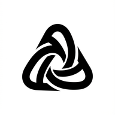</a>

  

**Alignify** · *where the research lives*

Every retainer leaves behind a constraint worth remembering — a head term too broad to rank, a share surface that embarrassed the founder, a taxonomy that should have compounded and didn't. Alignify is where those field notes become bilingual playbooks: SEO architecture, tool evaluation, distribution loops written so the next team can execute without me in the room.

</td>
<td width="33%" align="center" valign="top">

<a href="https://oginify.com/">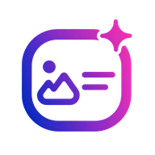</a>

  

**Oginify** · *where I fixed sharing*

There is a specific humiliation in watching a beautiful launch die in a group chat because the link preview looks broken. I saw it on repeat across client work — so in June 2026 I shipped my own answer in forty-eight hours: paste a URL, get four on-brand OG cards, no signup theater. The first product that's entirely mine, built with the same vibe-coding stack I now document in public.

</td>
<td width="33%" align="center" valign="top">

<a href="https://novascientia.com.br/">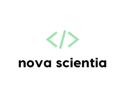</a>

  

**Nova Scientia** · *where I test going local*

Brazil doesn't need another translated English blog — it needs a map in Portuguese, with honest comparisons and search intent that actually matches how people look. Nova Scientia is me running the same research discipline in another language: **435+** tools reviewed, localization as strategy shipped in the open, not as a side project slide.

</td>
</tr>
</table>

---

## Open source

The loop doesn't stop at publish — it has to survive inside **Cursor**, **Claude Code**, and whatever agent stack teams wire up next. These repos are the execution layer: strategy in the sites above, mechanics in git.

<table>
<tr>
<td width="33%" valign="top">

**[marketing-skills](https://github.com/kostja94/marketing-skills)**  

When agents started reading Markdown for a living, I packaged a decade of growth craft into skills — page types, GEO, ads, analytics — so the playbook travels with the codebase, not in a Notion graveyard.

</td>
<td width="33%" valign="top">

**[Bricks](https://github.com/kostja94/bricks)**  

The component layer for AI agents — shared product, UX, accessibility, and validation guidance that adapts to the target project's stack and design system.

</td>
<td width="33%" valign="top">

**[OpenBlog](https://github.com/kostja94/openblog)**  

An agent-native, Git-based blog module for product websites — routes, content contracts, SEO primitives, and reviewable maintenance without a traditional CMS backend.

</td>
</tr>
</table>

Also maintained: [social-cards-skills](https://github.com/kostja94/social-cards-skills) for programmatic OG and Twitter Card generation, and [vibe-coding](https://github.com/kostja94/vibe-coding) for AI app-builder stacks and migration playbooks.

---

## Activity

  

---

## Trusted by 100+ AI/SaaS teams

*Client work since going independent — logos for illustration, not endorsements.*

    <table align="center" cellpadding="1" cellspacing="0">
      <tr>
        <td align="center" width="88"></td>
        <td align="center" width="88">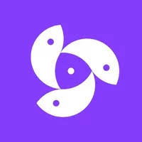</td>
        <td align="center" width="88">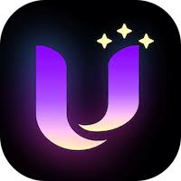</td>
        <td align="center" width="88">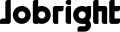</td>
        <td align="center" width="88">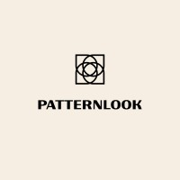</td>
        <td align="center" width="88"></td>
        <td align="center" width="88">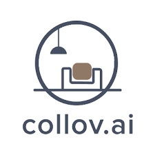</td>
        <td align="center" width="88">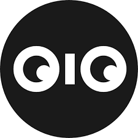</td>
      </tr>
      <tr>
        <td align="center" width="88">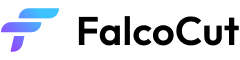</td>
        <td align="center" width="88">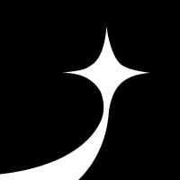</td>
        <td align="center" width="88">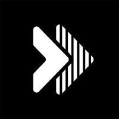</td>
        <td align="center" width="88">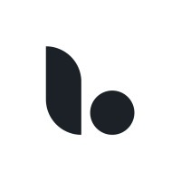</td>
        <td align="center" width="88">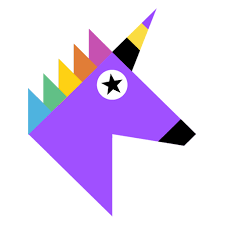</td>
        <td align="center" width="88">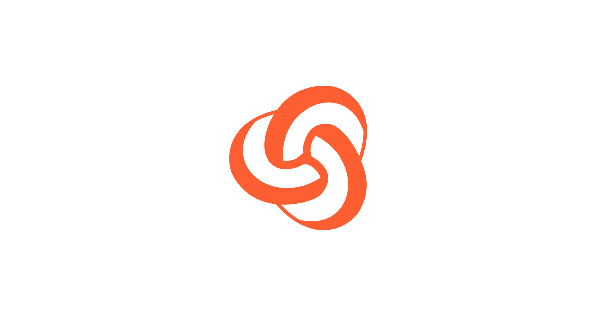</td>
        <td align="center" width="88"></td>
        <td align="center" width="88">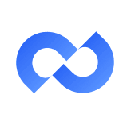</td>
      </tr>
      <tr>
        <td align="center" width="88">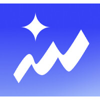</td>
        <td align="center" width="88">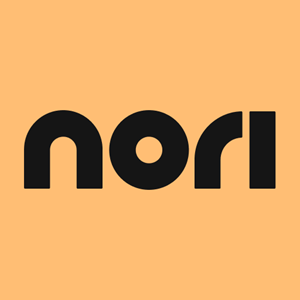</td>
        <td align="center" width="88">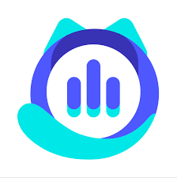</td>
        <td align="center" width="88"></td>
        <td align="center" width="88">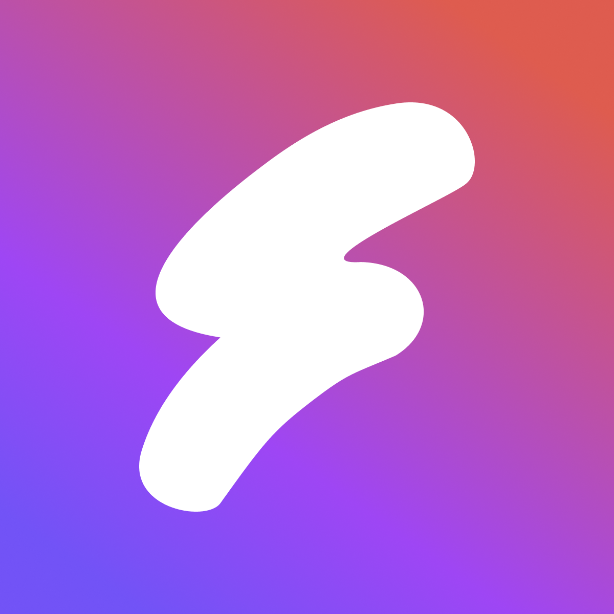</td>
        <td align="center" width="88"></td>
        <td align="center" width="88">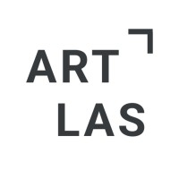</td>
        <td align="center" width="88"></td>
      </tr>
      <tr>
        <td align="center" width="88"></td>
        <td align="center" width="88">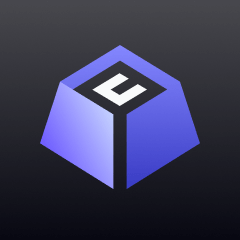</td>
        <td align="center" width="88"></td>
        <td align="center" width="88"></td>
        <td align="center" width="88">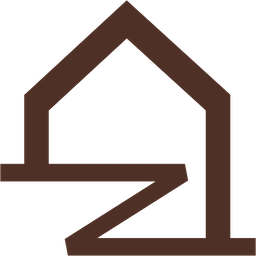</td>
        <td align="center" width="88"></td>
        <td align="center" width="88">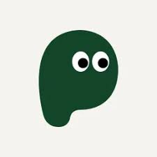</td>
        <td align="center" width="88">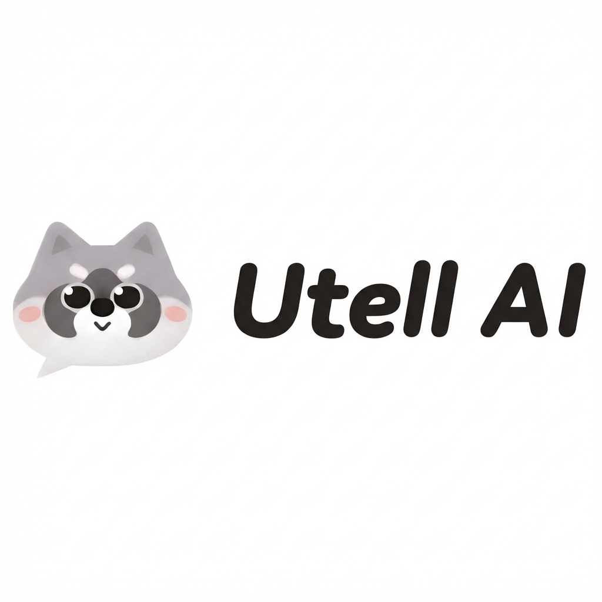</td>
      </tr>
      <tr>
        <td align="center" width="88">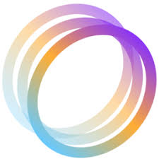</td>
        <td align="center" width="88">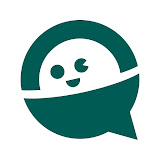</td>
        <td align="center" width="88">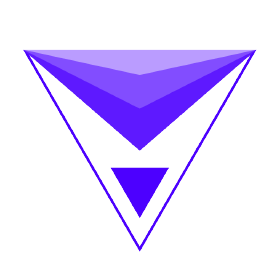</td>
        <td align="center" width="88">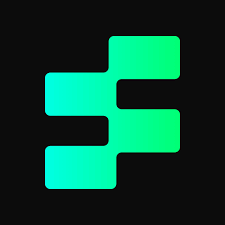</td>
        <td align="center" width="88">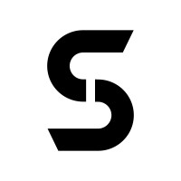</td>
        <td align="center" width="88"></td>
        <td align="center" width="88"></td>
        <td align="center" width="88"></td>
      </tr>
      <tr>
        <td align="center" width="88">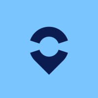</td>
        <td align="center" width="88">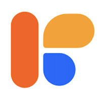</td>
        <td align="center" width="88">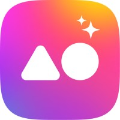</td>
        <td align="center" width="88">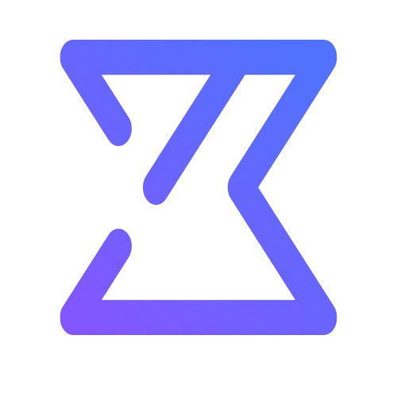</td>
        <td align="center" width="88"></td>
        <td align="center" width="88">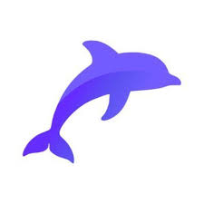</td>
        <td align="center" width="88"></td>
        <td align="center" width="88">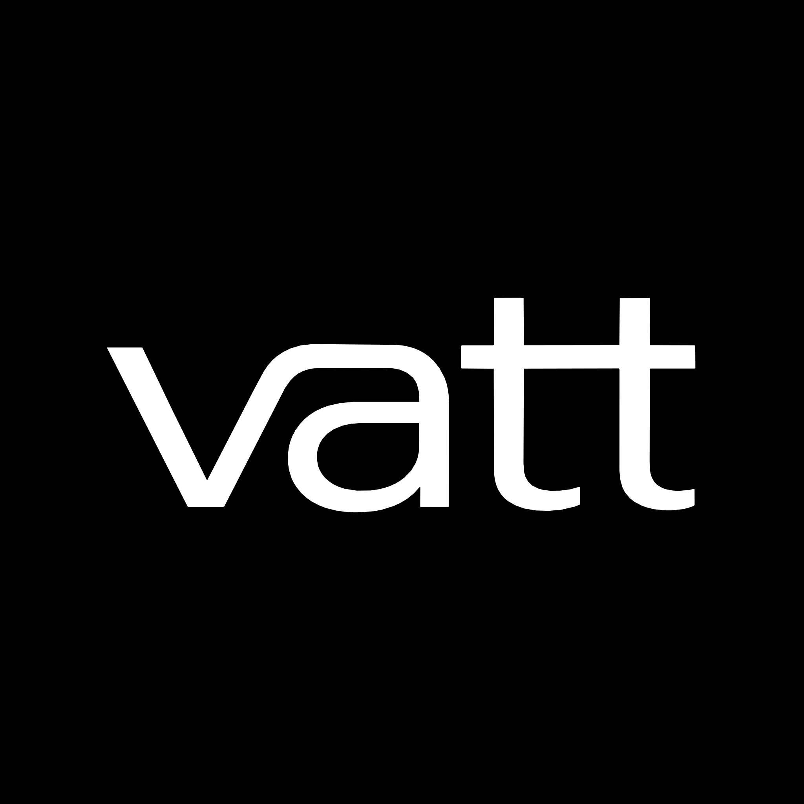</td>
      </tr>
      <tr>
        <td align="center" width="88"></td>
        <td align="center" width="88"></td>
        <td align="center" width="88">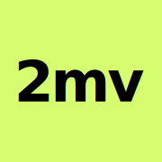</td>
        <td align="center" width="88"></td>
      </tr>
    </table>

<a href="https://alignify.co/customer-stories">see the plays →</a>

